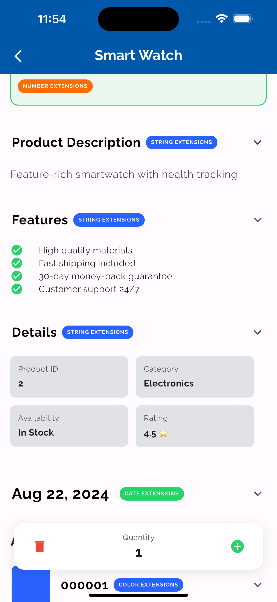
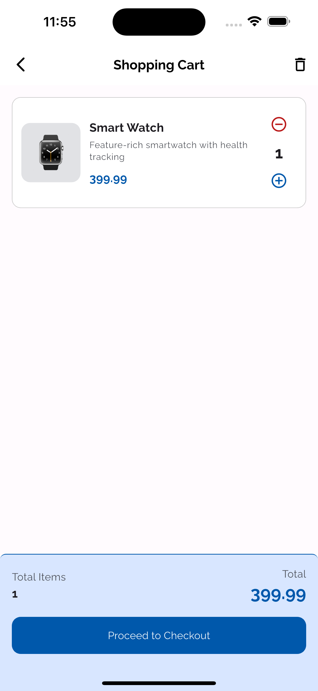

# 🛒 Flutter Extensions - Mini Shopping Cart Demo

> A comprehensive Flutter application demonstrating the power of Dart
> extension methods through a practical shopping cart implementation.

[](https://flutter.dev)
[](https://dart.dev)
[](LICENSE)


## 📱 App Screenshots





---

## 📖 About This Project

This project is a **hands-on training resource** designed for **intermediate-level Flutter developers** who want to master **Dart extension methods** - one of Dart's most powerful features for writing clean, maintainable code.

### What are Extension Methods?

Extension methods allow you to **add new functionality to existing types** without modifying their source code or creating subclasses. Introduced in Dart 2.6, they're a game-changer for:

- ✨ **Widget Composition** - Build fluent, readable UI code
- 🎯 **Code Reusability** - DRY (Don't Repeat Yourself) principles in action
- 🧠 **Business Logic** - Cleaner domain-specific operations
- 📦 **Third-party APIs** - Extend libraries you don't control

### Why Learn Extensions?

```dart
// ❌ Before Extensions (Traditional Flutter)
Container(
  padding: EdgeInsets.all(16),
  decoration: BoxDecoration(
    borderRadius: BorderRadius.circular(12),
    color: Colors.blue,
  ),
  child: Column(
    children: [
      Text('Title'),
      SizedBox(height: 8),
      Text('Subtitle'),
    ],
  ),
)

// ✅ After Extensions (40% Less Code, Infinitely More Readable)
Column(
  children: [
    Text('Title'),
    const Spacing(of: spacing8),
    Text('Subtitle'),
  ],
).paddingAll(spacing16)
 .container(color: blue, borderRadius: borderRadius12)
```

**Key Benefits:**

- Zero runtime overhead (resolved at compile-time)
- Improved code readability and maintainability
- Better IDE autocomplete and discoverability
- Ability to extend final/sealed classes
- Chainable, fluent APIs

Built with a **feature-driven architecture** inspired by production apps.

---

## 🎯 Learning Objectives

By completing this training, you'll learn to:

1. **Understand Extension Fundamentals**
   - What extensions are and how they work under the hood
   - Static resolution vs dynamic dispatch
   - Named vs unnamed extensions

2. **Apply Extensions Practically**
   - Extend Flutter widgets for cleaner UI code
   - Create domain-specific helpers (currency formatting, validation)
   - Work with generic extensions (`List<T>`, `Iterable<T>`)

3. **Master Best Practices**
   - When to use extensions (and when NOT to)
   - Handling extension conflicts
   - Privacy and visibility patterns
   - Performance considerations

4. **Build Production-Ready Code**
   - Organize extensions in a scalable project
   - Create reusable extension libraries
   - Integrate with state management (Riverpod)

---

## � What You'll Learn

- Extension method fundamentals and syntax
- Real-world extension patterns for Flutter
- Widget composition techniques with extensions
- State management with Riverpod
- String manipulation (camelCase ↔ snake_case, validation)
- Number formatting (currency, thousand separators)
- List operations with auto-spacing
- Best practices and anti-patterns
- Performance considerations

---

## 🚀 Quick Start

### Prerequisites

- Flutter SDK 3.9.2 or higher
- Dart SDK 3.9.2 or higher

### Installation

```bash
# Clone or navigate to the project
cd flutter_extensions

# Install dependencies
flutter pub get

# Run the app
flutter run
```

---

## 📱 Features

### Product Catalog

- 📦 List view with 8 sample products
- 🏷️ Category filtering (Electronics, Home, Sports, Accessories)
- 🎨 Beautiful Material Design 3 UI
- 📱 Responsive layout
- ✨ Product details with extension demonstrations

### Shopping Cart

- ➕ Add products with a single tap
- 🔢 Increment/decrement quantities
- 🗑️ Remove items or clear entire cart
- 💰 Real-time total calculation
- 🛒 Cart badge showing item count
- 📊 Empty state when no items

### Extension Demonstrations

- 🔢 **Number Extensions** - Currency formatting, discount calculations,
  price validation
- 📝 **String Extensions** - Case conversions (camelCase, snake_case,
  PascalCase, etc.)
- 🎨 **Color Extensions** - HEX conversion, color manipulation
- 📅 **Date Extensions** - 20+ date formatters (toFullDate, timeAgo,
  isToday, etc.)
- ✅ **Boolean Extensions** - Toggle, text conversions (toYesNo, toOnOff,
  toCheckmark)
- 📋 **List Extensions** - Auto-spaced layouts (toColumn, toRow)
- 🎭 **Context Extensions** - Theme, MediaQuery, navigation shortcuts
- 🧩 **Widget Extensions** - Padding, layout wrappers, fluent composition

---

## ✨ Extension Showcase

### How Extensions Work

Extensions in Dart are **static** - they're resolved at **compile-time** based on the static type of the object. They don't actually modify the class; instead, they're syntactic sugar for static helper functions.

```dart
// When you write this:
'hello'.capitalize

// Dart compiles it to something like this:
StringExtensions.capitalize('hello')
```

This means:

- **Zero runtime cost** - As fast as calling a static function
- **No dynamic dispatch** - Can't be overridden or used with `dynamic` types
- **Type-safe** - Full compile-time checking

### Context Extensions - Say Goodbye to Boilerplate

**Before:**

```dart
Theme.of(context).colorScheme.primary
MediaQuery.of(context).size.width
Navigator.of(context).pop()
ScaffoldMessenger.of(context).showSnackBar(SnackBar(content: Text('Hi')))
```

**After:**

```dart
context.colorScheme.primary
context.screenWidth
context.pop()
context.showSnackBar('Hi')
```

**Impact:** Reduces theme/navigation code by 60%, improves readability.

### Widget Extensions - Fluent UI Building

**Before:**

```dart
Padding(
  padding: EdgeInsets.all(16),
  child: Center(
    child: Card(
      elevation: 4,
      child: widget,
    ),
  ),
)
```

**After:**

```dart
widget.card(elevation: 4).center.paddingAll(16)
```

**Impact:** Write 70% less code, read from left-to-right like natural language.

### Number Extensions - Domain-Specific Helpers

**Before:**

```dart
Text('\$${price.toStringAsFixed(2).replaceAllMapped(
  RegExp(r'(\d{1,3})(?=(\d{3})+(?!\d))'), 
  (m) => '${m[1]},'
)}')
```

**After:**

```dart
Text(price.toUSD)           // '$1,234.56'
Text(price.formatWithCommas) // '1,234'
Text(price.discount20)       // Apply 20% discount
```

**Impact:** Eliminates repetitive formatting code, enforces consistency.

### String Extensions - Smart Text Manipulation

```dart
// Case conversion
'userId'.toCamelCase       // 'userId'
'user_id'.toSnakeCase      // 'user_id'
'userId'.toSnakeCase       // 'user_id'
'hello world'.toPascalCase // 'HelloWorld'

// Validation
'test@email.com'.isValidEmail  // true
'not-an-email'.isValidEmail    // false

// Formatting
'hello'.capitalize         // 'Hello'
'hello world'.toTitleCase  // 'Hello World'
```

### Color Extensions - HEX and Manipulation

```dart
// Color to HEX
color.toHex                    // 'FF00297F' (ARGB)
color.toHexNoAlpha             // '00297F' (RGB)
color.toHexNoAlphaWithHash     // '#00297F'

// HEX to Color
'#00297F'.toColor              // Color object
'00297F'.toColorOr(Colors.blue) // Safe parsing with fallback
```

### Date Extensions - Comprehensive Formatting

```dart
// Date formatting
date.toFullDate                // 'Monday, 15 January 2024'
date.toShortDate               // 'Jan 15, 2024'
date.toISODate                 // '2024-01-15'
date.toTime12Hour              // '2:30 PM'
date.timeAgo                   // '5 minutes ago'

// Date validation
date.isToday / date.isYesterday
date.isWeekend / date.isWeekday
date.isPast / date.isFuture
```

### Boolean Extensions - Text Conversions

```dart
isEnabled.toggle               // !isEnabled
flag.toYesNo                   // 'Yes' or 'No'
flag.toOnOff                   // 'ON' or 'OFF'
flag.toCheckmark               // '✓' or '✗'
flag.toInt                     // 1 or 0
```

### List Extensions - Auto-Spaced Layouts

**Before:**

```dart
Column(
  children: [
    Text('One'),
    const Spacing(of: 8),
    Text('Two'),
    const Spacing(of: 8),
    Text('Three'),
  ],
)
```

**After:**

```dart
[
  Text('One'),
  Text('Two'),
  Text('Three'),
].toColumn(spacing: 8)
```

**Impact:** Automatic spacing insertion, cleaner list-to-widget conversion.

[View complete extension cheatsheet →](docs/EXTENSION_CHEATSHEET.md)

---

## 📚 Documentation & Learning Path

### For Beginners

Start here to understand extension fundamentals:

| Resource | Description |
|----------|-------------|
| [📘 Official Dart Docs](https://dart.dev/language/extension-methods) | Comprehensive guide from the Dart team |
| [🎥 Flutter Video Tutorial](https://youtu.be/D3j0OSfT9ZI) | Visual walkthrough of extension methods |
| [📝 Extension Methods Blog](https://medium.com/dartlang/extension-methods-2d466cd8b308) | Deep dive by Dart language designer |

### For This Project

Structured learning materials for this training app:

| Document | Description | Level |
|----------|-------------|-------|
| [📘 TRAINING_GUIDE.md](docs/TRAINING_GUIDE.md) | Comprehensive training with exercises | Intermediate |
| [🎤 PRESENTATION_SLIDES.md](docs/PRESENTATION_SLIDES.md) | 31-slide workshop presentation | All levels |
| [📋 EXTENSION_CHEATSHEET.md](docs/EXTENSION_CHEATSHEET.md) | Quick reference for all extensions | All levels |
| [📊 PROJECT_SUMMARY.md](docs/PROJECT_SUMMARY.md) | Detailed project architecture overview | Advanced |

### Advanced Resources

Level up your extension skills:

- **[dartx Package](https://pub.dev/packages/dartx)** - Production-ready extension library with 50+ utilities
- **[Code with Andrea](https://codewithandrea.com/videos/dart-extensions-full-introduction/)** - Practical use cases and patterns
- **[Dart Samples Repo](https://github.com/dart-lang/samples/tree/main/extension_methods)** - Official extension examples from Google

---

## 🏗️ Project Architecture

This project demonstrates **real-world architectural patterns**:

```text
lib/
├── app/                    # Application setup & theme
├── global/
│   ├── extensions/        # ⭐ ALL EXTENSIONS HERE (8 categories)
│   ├── constants/         # Centralized design tokens
│   ├── widgets/          # Reusable components (Spacing, ValueChip,
│   │                      # Title widgets)
│   └── utils/            # TextLabel utility for demos
├── data/
│   ├── models/           # Product, CartItem (immutable)
│   └── repositories/     # Sample data provider
└── features/
    ├── products/         # Product catalog with filtering
    ├── details/         # Product detail with extension demos
    └── cart/            # Shopping cart with Riverpod
```

### Extension Categories

1. **context_extensions.dart** - Theme, MediaQuery, Navigation shortcuts
2. **widget_extensions.dart** - Padding, layout wrappers, Material helpers
3. **num_extensions.dart** - Currency (toUSD, toKES, toEUR, toGBP),
   formatting, discounts
4. **string_extensions.dart** - Case conversion (camelCase, snake_case,
   PascalCase, etc.), validation
5. **list_extensions.dart** - Auto-spaced Column/Row/ListView builders
6. **color_extensions.dart** - HEX conversion, color manipulation
7. **date_extensions.dart** - 20+ date formatters (toFullDate, timeAgo,
   isToday, etc.)
8. **bool_extensions.dart** - Toggle, text conversions (toYesNo, toOnOff,
   toCheckmark)

### State Management

- **Riverpod** for cart state and derived values
- **StateNotifier** pattern with immutable updates
- Computed providers for item count and total price

### Key Packages

- **flutter_riverpod** (^2.6.1) - State management
- **google_fonts** (^6.2.1) - Raleway font family
- **uuid** (^4.5.1) - Unique ID generation
- **gap** (^3.0.1) - Spacing widgets (Column/Row auto-adapt)
- **intl** (^0.20.2) - Number/currency formatting

[View detailed architecture →](docs/PROJECT_SUMMARY.md)

---

## 💻 Example Code

```dart
// Product card with extensions
Widget build(BuildContext context, WidgetRef ref) {
  return Container(
    decoration: BoxDecoration(
      color: itemInCart ? appGreen.withValues(alpha: .1) : white,
      borderRadius: borderRadius12,
      border: Border.all(
        color: itemInCart ? appGreen : black.withValues(alpha: .2),
      ),
    ),
    child: Column(
      children: [
        Text(product.imageUrl, style: const TextStyle(fontSize: 64)),
        const Spacing(of: 4),
        Text(product.name, style: context.textTheme.titleMedium),
        const Spacing(of: 4),
        Text(product.description),
        const Spacing(of: 8),
        ValueChip(
          valueText: product.category,
          backColor: black.withValues(alpha: .1),
        ),
        const Spacing(of: 8),
        Text(product.priceText, style: context.textTheme.titleLarge),
      ],
    ),
  );
}
```

**Result:** Clean, readable code with consistent spacing and styling! 🎉

---

## 🎓 For Trainers

Perfect for teaching:

- Dart language features (extension methods)
- Clean code principles
- Flutter best practices
- State management patterns (Riverpod)
- Material Design 3 implementation

[View workshop guide →](docs/TRAINING_GUIDE.md)

---

## 💡 Best Practices & Anti-Patterns

### ✅ DO Use Extensions For

1. **Adding convenience methods** to existing types

   ```dart
   extension on String {
     bool get isBlank => trim().isEmpty;
   }
   ```

2. **Creating fluent APIs** for better readability

   ```dart
   Text('Hello').paddingAll(16).center
   ```

3. **Domain-specific helpers** that don't belong in the core type

   ```dart
   extension on double {
     String get toUSD => NumberFormat.currency(
       symbol: '\$',
       decimalDigits: 2,
     ).format(this);
   }
   ```

### ❌ DON'T Use Extensions For

1. **Business logic that belongs in a class**

   ```dart
   // ❌ Bad - Temperature should be its own type
   extension on double {
     double celsiusToFahrenheit() => this * 1.8 + 32;
   }
   
   // ✅ Good - Proper domain modeling
   class Temperature {
     final double celsius;
     double get fahrenheit => celsius * 1.8 + 32;
   }
   ```

2. **Adding state** (extensions can't have instance fields)

   ```dart
   // ❌ This won't compile
   extension on String {
     int callCount = 0;  // Error!
   }
   ```

3. **When a simple function is clearer**

   ```dart
   // Sometimes a function is better than forcing an extension
   int calculateTotal(List<int> prices) => prices.fold(0, (a, b) => a + b);
   ```

### Handling Extension Conflicts

When two extensions define the same member:

```dart
// Option 1: Use explicit extension application
NumberParsing('42').parseInt()

// Option 2: Hide conflicting extension on import
import 'string_apis.dart';
import 'string_apis_2.dart' hide NumberParsing2;

// Option 3: Import with prefix
import 'string_apis_3.dart' as rad;
rad.NumberParsing('42').parseInt()
```

### Performance Tips

- Extensions have **zero runtime overhead** (compiled to static calls)
- Safe to use in performance-critical code
- Consider using `const` constructors in extension chains when possible

---

## 🛠️ Example Code Walkthrough

Here's a complete example showing extensions in action:

This is a training project! Contributions welcome:

- 🐛 Report bugs
- 💡 Suggest new extensions
- 📝 Improve docs
- ✨ Add features

---

## 🎉 Key Takeaways

> **Extensions aren't just syntactic sugar—they're a powerful tool for
> writing better, more maintainable Flutter code.**

### What You've Learned

- ✅ Extensions add functionality to existing types without inheritance
- ✅ They're resolved statically at compile-time (zero runtime cost)
- ✅ Perfect for creating fluent, readable APIs
- ✅ Can extend sealed/final classes and third-party libraries
- ✅ Should be used thoughtfully, not as a dumping ground for helpers

### When to Use Extensions

| Use Case | Recommended? | Why |
|----------|--------------|-----|
| UI helper methods | ✅ Yes | Reduces boilerplate, improves readability |
| Domain-specific formatting | ✅ Yes | Keeps formatting logic centralized |
| Third-party library helpers | ✅ Yes | Extends APIs you don't control |
| Business logic | ❌ No | Should be in proper domain classes |
| Stateful operations | ❌ No | Extensions can't hold state |

### Next Steps

1. **Explore the codebase** - Run the app and examine the extensions
2. **Complete the exercises** in [TRAINING_GUIDE.md](docs/TRAINING_GUIDE.md)
3. **Experiment** - Try adding your own extensions
4. **Share** - Use these patterns in your own projects

### Additional Resources

- **[Official Dart Documentation](https://dart.dev/language/extension-methods)**
  \- Comprehensive reference
- **[dartx Package](https://pub.dev/packages/dartx)** - 50+
  production-ready extensions
- **[Flutter Extensions Video](https://youtu.be/D3j0OSfT9ZI)** - Visual
  walkthrough
- **[Dart Blog Post](https://medium.com/dartlang/extension-methods-2d466cd8b308)**
  \- Deep dive by language designer

---

## 🤝 Contributing & Feedback

This is an educational project! Contributions are welcome:

- 🐛 **Report bugs** via GitHub Issues
- 💡 **Suggest new extensions** that would be valuable for learning
- 📝 **Improve documentation** - clarity is key for training
- ✨ **Add features** - more examples, more exercises

**Questions?** Open an issue or discussion on GitHub.

---

## 📄 License

MIT License - Feel free to use this project for learning and training
purposes.

---

**Ready to master Dart extensions?** Clone the repo, run the app, and
start your journey! 🚀

Made with ❤️ for Flutter developers who want to write cleaner code.
